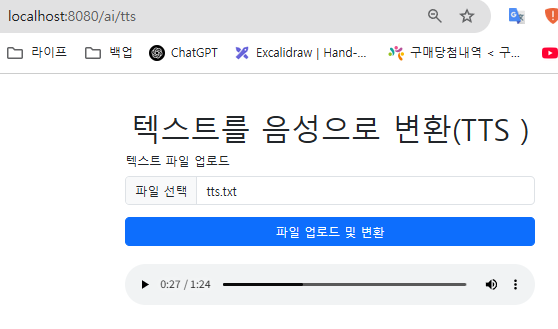
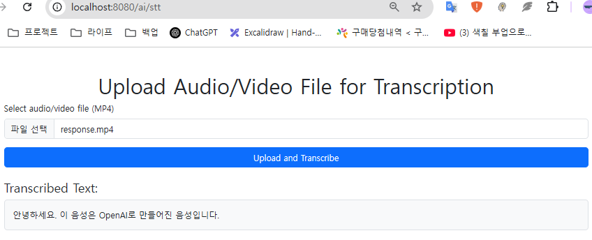
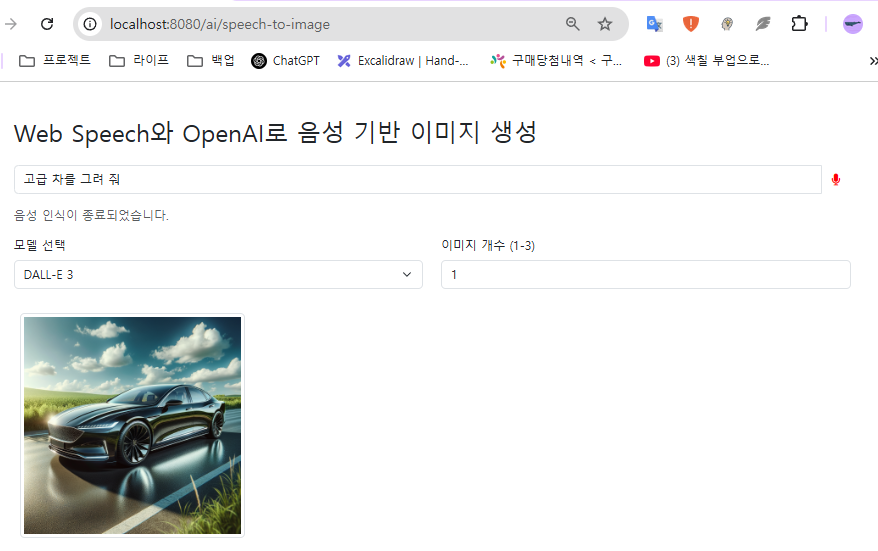

# 프로젝트

## 개발환경
```
java
    JDK21
Springboot
    implementation 'org.springframework.ai:spring-ai-openai-spring-boot-starter'
IDE
    IntelliJ IDEA Communication     
연동
    chaGPT API Key     
    yutube  API Key
```


## 이미지 생성


## 이미지를 텍스트로 변환 관련 자료 링크 추천


## 텍스트를 음성으로 변환



## 음성을 텍스트로 변환



## 음성을 이미지로 변환



## 사용자 친화 검색

